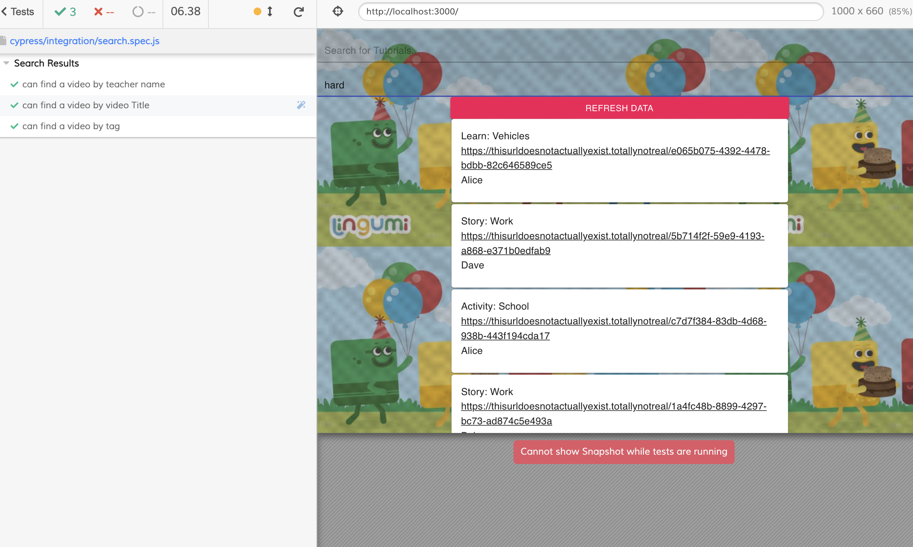

# Vid-Tutorial
Welcome to this English learning portal.

On the site there are two search bars for you to find the video you are looking for.
1. *Search For Tutorial*: This will search through both the video title and teacher name.
2. *Search Using Tags*: This will search **only** using the tags the creator thinks applicable.

### Results
* Your results will be rendered in a series of cards. Each card will have the video title, video URL and teacher name. 
* **Note**: Results will be ordered by the best average user rating. The top card on the screen, has been rated the **best**.

# Boilerplates & Frameworks

* create-react-app to start the project
* Material-UI used for some styling
* Cypress used for testing

# Instructions for Vid-Tutorial: Lingumi Tech Test

In the project directory, you can run:

### `npm start`

Runs the app in the development mode.\
Open [http://localhost:3000](http://localhost:3000) to view it in the browser.

The page will reload if you make edits.\
You will also see any lint errors in the console.

### `npx cypress open`

Launches the Cypress UI where tests can be ran. A screenshot can be seen below:

# Limitations & Assumptions

* The search functions will render **no results** if there is no match to the JSON data.

* The two search functions cannot be used in conjunction, for example you cannot search for a teacher and then refine the search using tags. 

* The data card will render the URL for the video. It is assumed that if the link were active, this would render the video linked.
